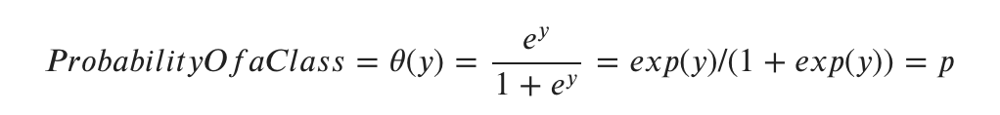
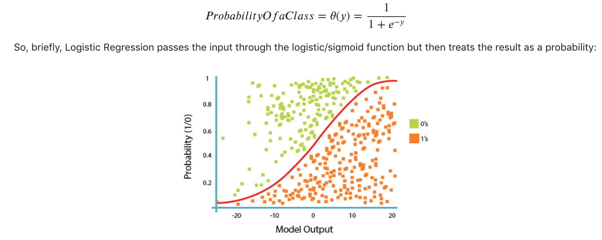
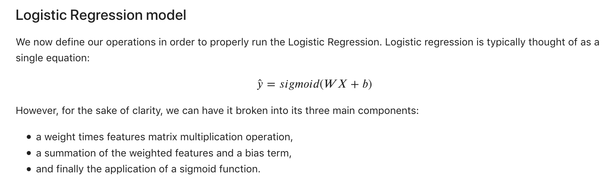
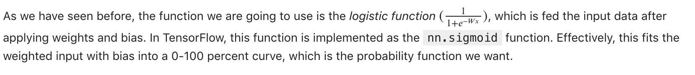
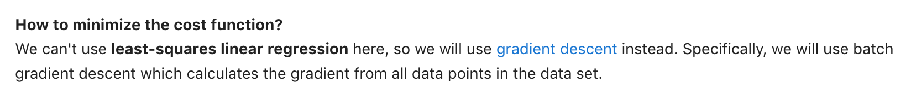
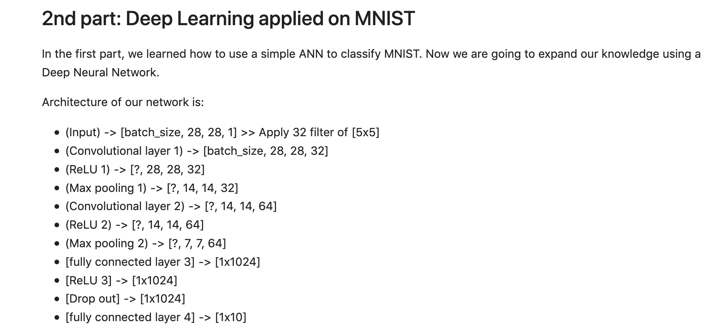

**Installing Tensorflow:**
1. pip install --upgrade pip
2. pip install tensorflow

**Linear regression:**
1. Udpate brew using `brew install wget`
2. Get the data using `wget -O FuelConsumption.csv https://s3-api.us-geo.objectstorage.softlayer.net/cf-courses-data/CognitiveClass/ML0101ENv3/labs/FuelConsumptionCo2.csv`
3. Follow the steps mentioned in the linear regression and once you are at the point of deciding what value should be chosen for learning rate, do this: We define the optimizer method. The gradient Descent optimizer takes in parameter: learning rate, which corresponds to the speed with which the optimizer should learn; there are pros and cons for increasing the learning-rate parameter, with a high learning rate the training model converges quickly, but there is a risk that a high learning rate causes instability and the model will not converge. Please feel free to make changes to learning parameter and check its effect. On the other hand decreasing the learning rate might reduce the convergence speed, but it would increase the chance of converging to a solution. You should note that the solution might not be a global optimal solution as there is a chance that the optimizer will get stuck in a local optimal solution. Please review other material for further information on the optimization. Here we will use a simple gradient descent with a learning rate of 0.05:
optimizer = tf.train.GradientDescentOptimizer(0.05)

**Logistic Regression:**

**Neural Networks:**

See first part of ANN on cnn.py and then refer to DL code in the later part of cnn.py following:

**GD vs Stochastic GD**

While in GD, you have to run through ALL the samples in your training set to do a single update for a parameter in a particular iteration, in SGD, on the other hand, you use ONLY ONE or SUBSET of training sample from your training set to do the update for a parameter in a particular iteration. If you use SUBSET, it is called Minibatch Stochastic gradient Descent.

