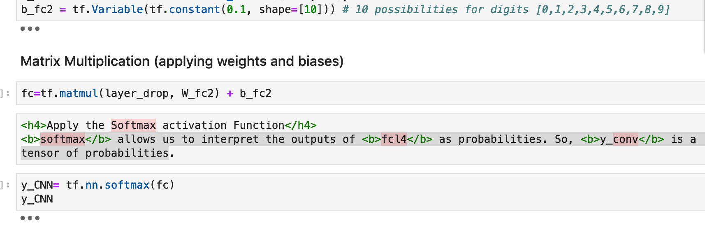
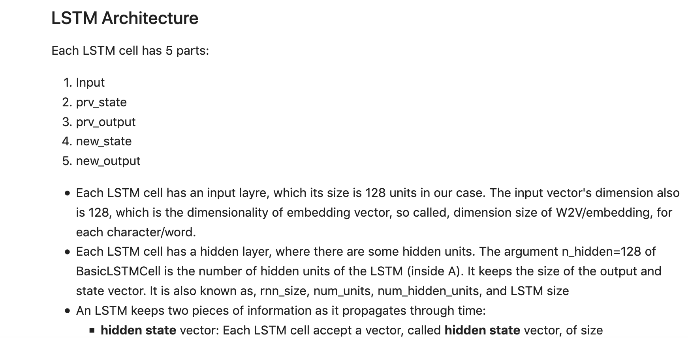
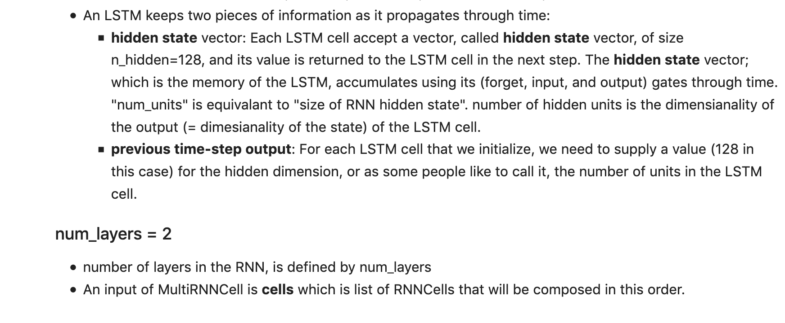

**Installing Tensorflow:**
1. pip install --upgrade pip
2. pip install tensorflow

**Linear regression:**
1. Udpate brew using `brew install wget`
2. Get the data using `wget -O FuelConsumption.csv https://s3-api.us-geo.objectstorage.softlayer.net/cf-courses-data/CognitiveClass/ML0101ENv3/labs/FuelConsumptionCo2.csv`
3. Follow the steps mentioned in the linear regression and once you are at the point of deciding what value should be chosen for learning rate, do this: We define the optimizer method. The gradient Descent optimizer takes in parameter: learning rate, which corresponds to the speed with which the optimizer should learn; there are pros and cons for increasing the learning-rate parameter, with a high learning rate the training model converges quickly, but there is a risk that a high learning rate causes instability and the model will not converge. Please feel free to make changes to learning parameter and check its effect. On the other hand decreasing the learning rate might reduce the convergence speed, but it would increase the chance of converging to a solution. You should note that the solution might not be a global optimal solution as there is a chance that the optimizer will get stuck in a local optimal solution. Please review other material for further information on the optimization. Here we will use a simple gradient descent with a learning rate of 0.05:
optimizer = tf.train.GradientDescentOptimizer(0.05)

**Logistic Regression:**

**Neural Networks:**

See first part of ANN on cnn.py and then refer to DL code in the later part of cnn.py following:

**GD vs Stochastic GD**

While in GD, you have to run through ALL the samples in your training set to do a single update for a parameter in a particular iteration, in SGD, on the other hand, you use ONLY ONE or SUBSET of training sample from your training set to do the update for a parameter in a particular iteration. If you use SUBSET, it is called Minibatch Stochastic gradient Descent. Thus, if the number of training samples are large, in fact very large, then using gradient descent may take too long because in every iteration when you are updating the values of the parameters, you are running through the complete training set. On the other hand, using SGD will be faster because you use only one training sample and it starts improving itself right away from the first sample.
SGD often converges much faster compared to GD but the error function is not as well minimized as in the case of GD. Often in most cases, the close approximation that you get in SGD for the parameter values are enough because they reach the optimal values and keep oscillating there.
Summarizing, in Gradient Descent or Batch Gradient Descent, we use the whole training data per epoch whereas, in Stochastic Gradient Descent, we use only single training example per epoch and Mini-batch Gradient Descent lies in between of these two extremes, in which we can use a mini-batch(small portion) of training data per epoch, thumb rule for selecting the size of mini-batch is in power of 2 like 32, 64, 128 etc.

**Constructing a CNN/DNN network**

**Constructing a RNN network**

**LSTM for character sequence***

**Restricted Boltzmann Machines (RBMs)**

